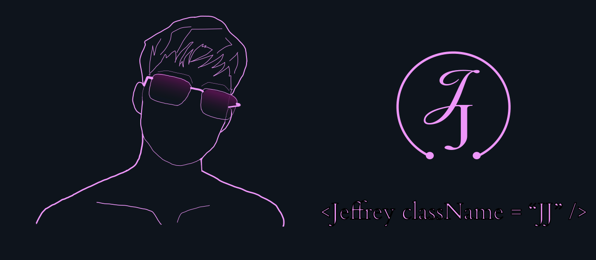

<head>
 <link rel="stylesheet" href="style.css">
<link>
</head>

  

## 👋 ¿Listos para programar hoy?

#👋 ¡Hola! Soy Jeffrey Mardoqueo (J.J), un apasionado estudiante de desarrollo de software con un enfoque especializado en el desarrollo frontend y un firme objetivo de convertirme en un #desarrollador full stack. 🚀

#💼 Actualmente, me encuentro en el proceso de adquirir experiencia y conocimientos en el mundo del desarrollo web, centrándome en tecnologías como HTML, CSS y JavaScript para #crear interfaces de usuario atractivas y funcionales.

#🌐 Mi interés no se limita únicamente al frontend. Estoy comprometido en ampliar mi conjunto de habilidades para convertirme en un desarrollador full stack, lo que significa #que estoy explorando tecnologías del lado del servidor, bases de datos y la integración de sistemas para ofrecer soluciones completas y versátiles.

🔧 Algunas de las tecnologías y herramientas con las que trabajo incluyen:

- HTML5, CSS3 para diseño y maquetación.
- JavaScript y librerías/frameworks como React para crear experiencias interactivas.
- Node.js y Express.js para construir aplicaciones backend.
- Bases de datos SQL
- Control de versiones con Git y GitHub, por supuesto.

📚 Siempre estoy aprendiendo y buscando oportunidades para mejorar mis habilidades. Actualmente, estoy trabajando en ub proyecto de gestion de pagos de colegiaturas y una aplicacion movil para aplicar lo que he aprendido y colaborar con la comunidad de desarrolladores.

📫 Puedes contactarme a través de mi correo electrónico [jeffreymardoqueo260@gmail.com] o encontrarme en LinkedIn [...],

<!--
**JeffreyMardoqueo-17/JeffreyMardoqueo-17** is a ✨ _special_ ✨ repository because its `README.md` (this file) appears on your GitHub profile.

Here are some ideas to get you started:

- 🔭 I’m currently working on ...
- 🌱 I’m currently learning ...
- 👯 I’m looking to collaborate on ...
- 🤔 I’m looking for help with ...
- 💬 Ask me about ...
- 📫 How to reach me: ...
- 😄 Pronouns: ...
- ⚡ Fun fact: ...
-->
