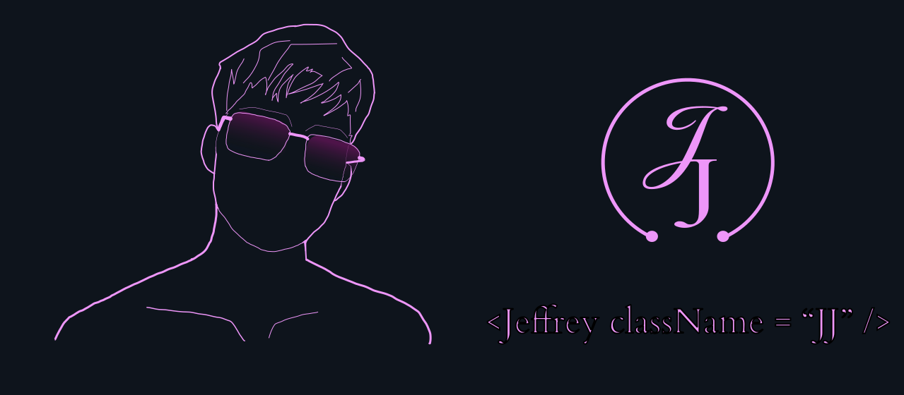

<head>
 <link rel="stylesheet" href="style.css">
<link>
</head>

<!--   
 -->

<!-- Encabezado estilo banner -->
<h1 align="center">Hi 👋, I'm Jeffrey Mardoqueo</h1>
<h3 align="center">.NET Fullstack Developer | Aspiring Forex Trader | 🚀</h3>

<h5 align="center">Puede que no lo sepa hoy; lo aprendo🚀</h5>

  

<h2>👨‍💻 About Me</h2>

  Fullstack Developer specialized in the .NET ecosystem. 
  I work with technologies like <strong>C#, ASP.NET, SQL Server, React, Next.js</strong>, and <strong>TypeScript</strong>, applying <strong>SOLID principles</strong> and architectural best practices. 
  Focused on writing clean, scalable, and well-structured code, with a long-term vision of becoming a <strong>software architect</strong>.

<h3 align="left">Conecta conmigo:</h3>

   

<h3 align="left">🔥 Mis estadisticas: </h3>

    

        
    

